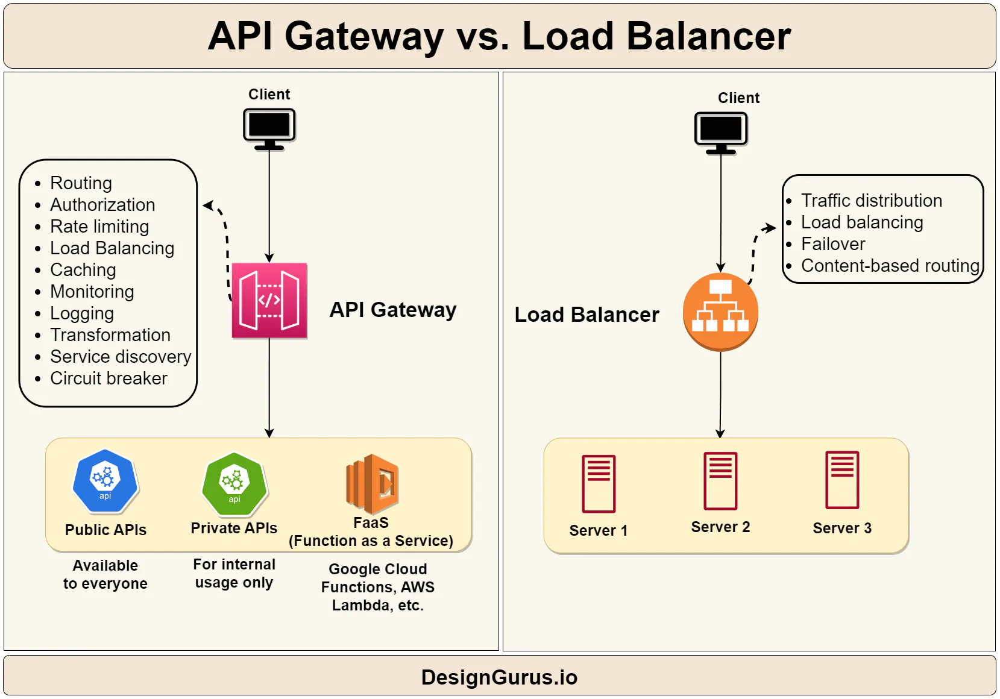

# api-gateway

In a microservices architecture, each microservice exposes a set of (typically) fine-grained endpoints. 
This fact can impact the client-to-microservice communication, as explained in this section

A direct client-to-microservice communication architecture could be good enough for a small microservice-based application.
However, when you build large and complex microservice-based applications (for example, when handling dozens of
microservice types), and especially when the client apps are remote mobile apps or SPA web applications, that approach
faces a few issues. 
• Interacting with multiple microservices to build a single UI screen increases the number of round trips across the Internet. 
  This approach increases latency and complexity on the UI side. 
•Implementing security and cross-cutting concerns like security and authorization on every microservice can require significant development effort. 
• Protocols used on the server side (like AMQP or binary protocols) are not supported in client apps. Therefore, requests must be performed through protocols like HTTP/HTTPS and translated to the other protocols afterwards. 

**Introduction**:
An 𝗔𝗣𝗜 𝗴𝗮𝘁𝗲𝘄𝗮𝘆 is a server that acts as an intermediary between clients and backend servers. 
The API gateway is responsible for managing API requests, enforcing security policies, 
and handling authentication and authorization. API gateways are ideal for microservices architectures,
where multiple services need to be accessed through a single API.

**Overview**::
API Gateway is software that exposes backend services and provides a standardized interface for clients. 
It simplifies the management and integration of multiple APIs and enhances scalability by offloading workloads from 
backend services to the gateway server.
For example, suppose you have a microservices-based architecture that uses multiple APIs to provide different functionalities. 
In this case, an API gateway can help simplify the management and integration of these APIs, providing a single entry point for clients.
API gateways can also perform authentication, rate limiting, and caching, improving security and performance. 
In addition, API gateways can be used to transform data formats, such as converting XML to JSON, to provide a consistent interface for clients.

**Benefits** 
API Gateways offer several benefits for organizations, including:
•	Flexible service composition: API Gateways enable organizations to compose multiple backend services into a single API, simplifying the development process and reducing complexity.
•	Inter-service communication: API Gateways facilitate communication between microservices, making it easier to build complex applications.
•	Load balancing: API Gateways distribute incoming requests across multiple instances of a service, ensuring that no single instance is overloaded.
•	Management and integration: API Gateways provide a centralized location for managing and monitoring all API traffic, making it easier to maintain and troubleshoot the system.
•	Scalability: API Gateways enable organizations to scale their services horizontally, adding or removing instances as needed to handle changes in traffic volume.
•	Security: API Gateways provide a layer of security between the backend services and external clients, protecting against attacks and unauthorized access.
•	Network performance: API Gateways optimize network performance by reducing the number of round trips required to access multiple services.
Common

Main features in the API Gateway pattern
An API Gateway can offer multiple features. Depending on the product it might offer richer or simpler features, however,
the most important and foundational features for any API Gateway are the following design patterns:

**Reverse proxy or gateway routing**. The API Gateway offers a reverse proxy to redirect or route requests (layer 7 routing, 
usually HTTP requests) to the endpoints of the internal microservices. The gateway provides a single endpoint
or URL for the client apps and then internally maps the requests to a group of internal microservices.
This routing feature helps to decouple the client apps from the microservices but it's also convenient when modernizing
a monolithic API by sitting the API Gateway in between the monolithic API and the client apps, then you can add new APIs 
as new microservices while still using the legacy monolithic API until it's split into many microservices in the future.
Because of the API Gateway, the client apps won't notice if the APIs being used are implemented as internal microservices 
or a monolithic API and more importantly, when evolving and refactoring the monolithic API into microservices, 
thanks to the API Gateway routing, client apps won't be impacted with any URI change.
#Sample Architecture

**Requests aggregation.** As part of the gateway pattern you can aggregate multiple client requests (usually HTTP requests)
targeting multiple internal microservices into a single client request. This pattern is especially convenient 
when a client page/screen needs information from several microservices. With this approach, the client app sends a single 
request to the API Gateway that dispatches several requests to the internal microservices and then aggregates the results 
and sends everything back to the client app. 
The main benefit and goal of this design pattern is to reduce chattiness between the client apps and the backend API.

**Cross-cutting concerns or gateway offloading**. Depending on the features offered by each API Gateway product, you can offload functionality from individual microservices to the gateway, which simplifies the implementation of each microservice by consolidating cross-cutting concerns into one tier. This approach is especially convenient for specialized features that can be complex to implement properly in every internal microservice, such as the following functionality:

Authentication and authorization
Service discovery integration
Response caching
Retry policies, circuit breaker, and QoS
Rate limiting and throttling
Load balancing
Logging, tracing, correlation
Headers, query strings, and claims transformation
IP allowlisting

**Multiple ApiGatewys**

When splitting the API Gateway tier into multiple API Gateways, if your application has multiple client apps, 
that can be a primary pivot when identifying the multiple API Gateways types, so that you can have a different facade for 
the needs of each client app. This case is a pattern named "**Backend for Frontend" (BFF)** where each API Gateway can provide
a different API tailored for each client app type, possibly even based on the client form factor by implementing specific 
adapter code which underneath calls multiple internal microservices, as shown in the following image:

Comparing Load Balancer and API Gateway

Additional resources
Chris Richardson. Pattern: API Gateway / Backend for Front-End
https://microservices.io/patterns/apigateway.html

API Gateway pattern
https://learn.microsoft.com/azure/architecture/microservices/gateway

Aggregation and composition pattern
https://microservices.io/patterns/data/api-composition.html

Azure API Management
https://azure.microsoft.com/services/api-management/

https://www.designgurus.io/blog/Load-Balancer-Reverse-Proxy-API-Gateway

